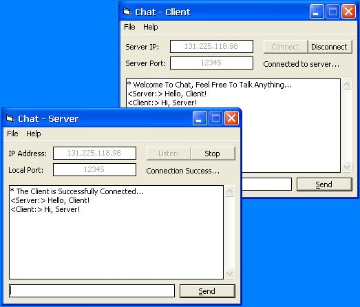



## Basic Chat Program

### Description

this is my third submission to PSC, a basic Chat program. very easy to understand and learn, contains client and server... im a beginner in winsock, so i need your comments, suggestions, questions and criticism (hope not). if you find it usefull, then thanx and vote if you want. God Bless...
 
### More Info
 

             |
---                |---
**Submitted On**   |2002-09-18 02:44:42
**By**             |[Vanni Alora](https://github.com/Planet-Source-Code/PSCIndex/blob/master/ByAuthor/vanni-alora.md)
**Level**          |Beginner
**User Rating**    |4.9 (34 globes from 7 users)
**Compatibility**  |VB 5\.0, VB 6\.0
**Category**       |[Internet/ HTML](https://github.com/Planet-Source-Code/PSCIndex/blob/master/ByCategory/internet-html__1-34.md)
**World**          |[Visual Basic](https://github.com/Planet-Source-Code/PSCIndex/blob/master/ByWorld/visual-basic.md)
**Archive File**   |[Basic\_Chat1333149192002\.zip](https://github.com/Planet-Source-Code/vanni-alora-basic-chat-program__1-39126/archive/master.zip)

